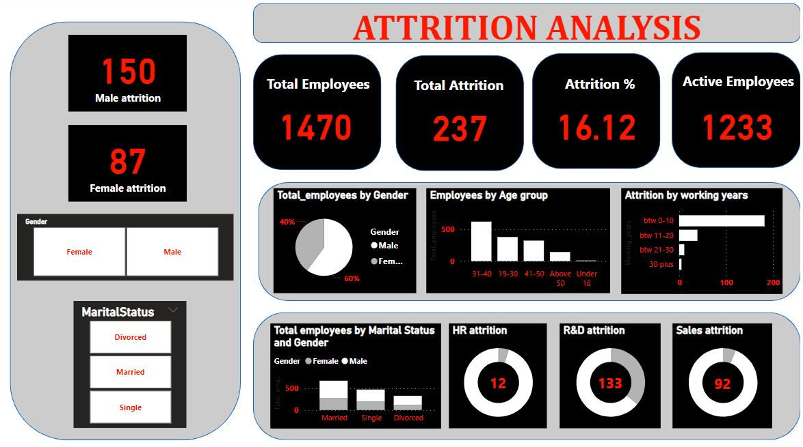

## Attrition Analysis

### Introduction:

Developed a comprehensive PowerBI dashboard for analyzing attrition trends, facilitating HR personnel in efficiently interpreting attrition statistics. The dashboard provides insights into attrition patterns based on gender, years of experience, marital status, age group, and departmental divisions, ensuring a holistic understanding of workforce dynamics.

Analysis from the created dashboard: 
Male attrition is more as compared to female. 
Attrition rate decreases as the years of experience increase. 
R&D department has highest attrition. 
Attrition rate decreases as the age increases. 

 
 

### Glimpse of the dashboard:

  

